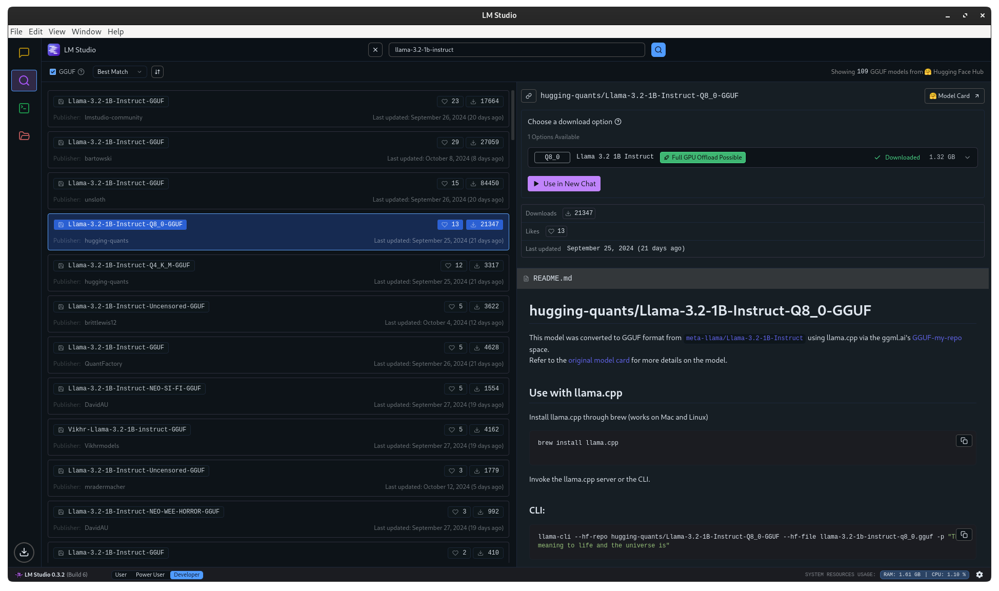
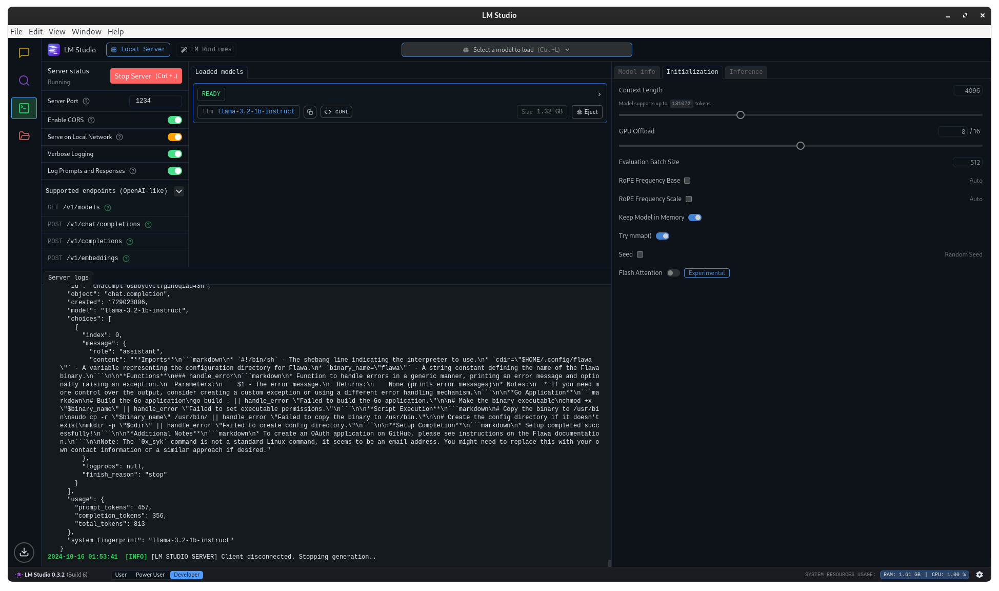
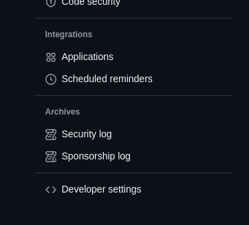
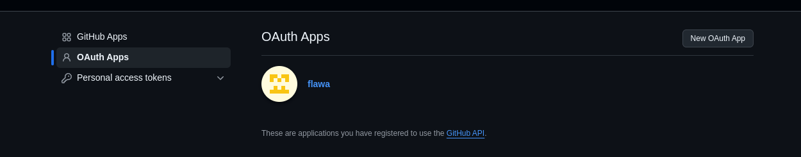
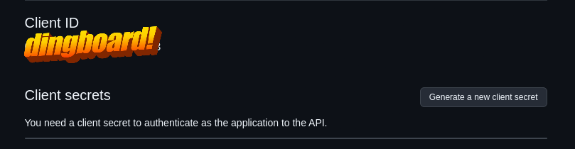
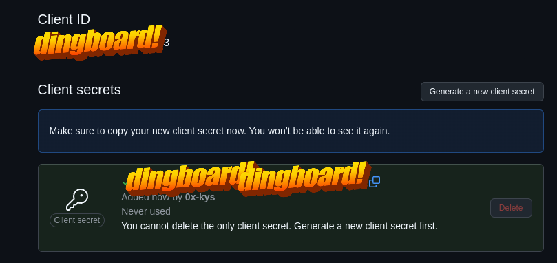

# Initial Setup

## LMStudio (w/ hugging-quants llama-3.2-1b-instruct)

[**Download LM Studio**](https://lmstudio.ai/)

Once download is complete simply head over to developer section and frop top mid part load the model.

After that you need to set same setting on left and start server

> [!NOTE]
> LM Studio will keep running in background.

## Github OAuth Application

For Github OAuth you need to add your `CLIENT_ID` and `CLIENT_SECRET` to `$HOME/.config/flawa/.env`

Go to github dot com and open settings
After that you'll see "Developer Settings" on bottom left of navigation bar

Open it and then go to OAuth aaps and click on "New OAuth App"

After that yeet your info making sure "Authorization callback URL" is `http://localhost:8080/callback` and hit register application

Then you'll see something like this now you can proudly hit "Generate a new client secret"

Now copy client id and client secret and yeet them into `$HOME/.config/flawa/.env`

After all this you can try logging in using flawa

`flawa login`
